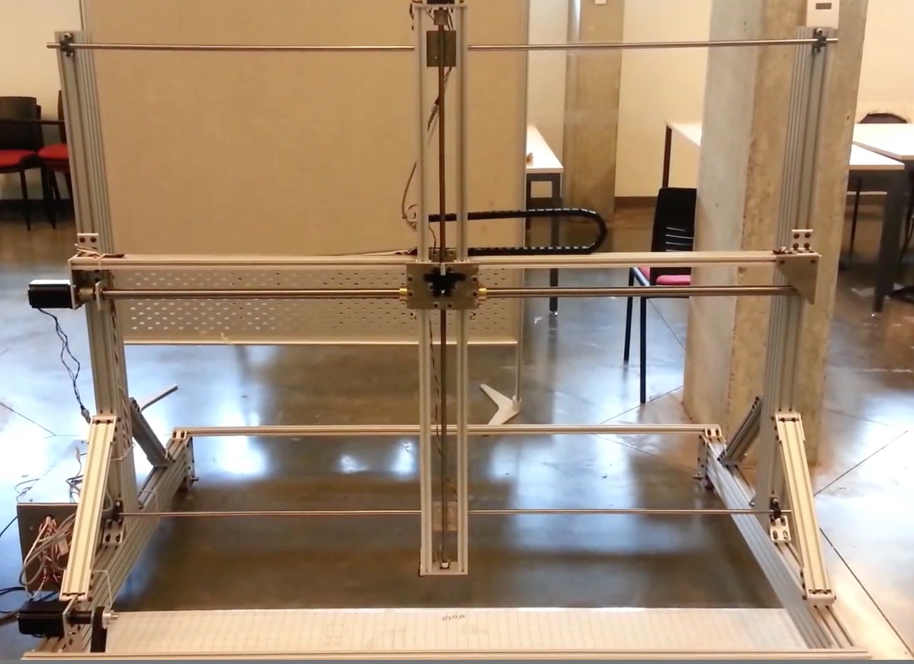

# NHC_Carriage_Controller

Arduino sketch written to control and operate an instrumentation carriage.

The project's goal was to build an instrumentation carraige to automate measurements in a pool (e.g. temperature, viscosity, etc.).

This sketch receives X, Y, Z Coordinates as inputs from a custom PC Software, and actuates the carriage to move to the corresponding location.

# Youtube Link

https://www.youtube.com/watch?v=CBSIBG8Ad4A

# Notes
This project was built for Northwest Hydraulic Consultants.
